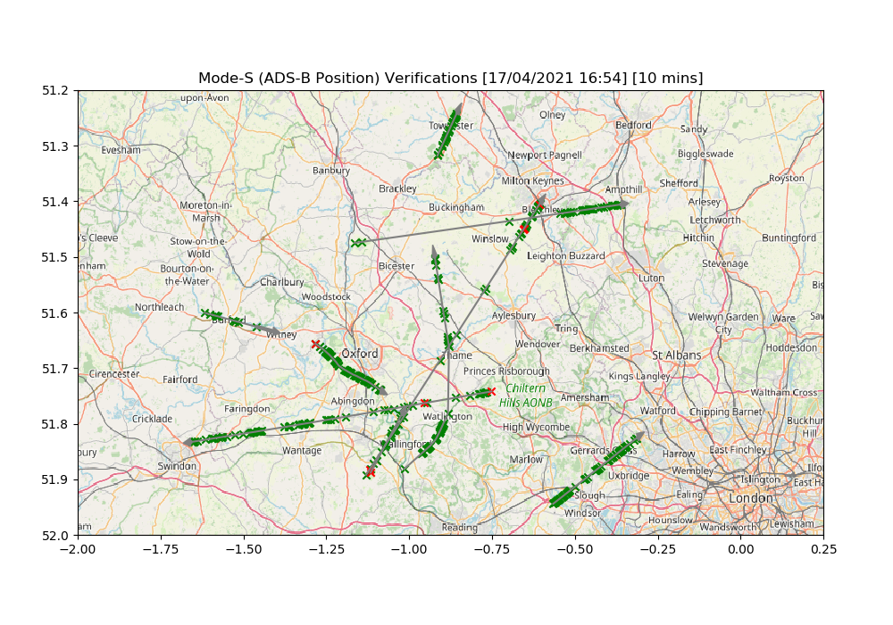

# Automatic PHY-layer Fingerprinting

### ADS-B Verification Example

To illustrate the behaviour of the framework, a concrete example for the fingerprinting of ADS-B traffic is implemented. The system in under active developement and has not yet undergone a substantial evaluation. Nonetheless, initial testing shows the system to perform moderately, albeit underperforming the state of the art (see Related Work) at present.

The ADS-B verifier operates under the following threat model:

* The system is developed under a threat model that considers compromised devices and low-resourced SDR attackers. Key to both of these is that the attacker is not able to fully match the physical characteristics of another transmitter (although they may do so to some extent). 
* The system does not, at present, attempt to protect against a well-resourced SDR attacker. In this case the attacker is able to mimic another transmitter with arbitrary precision. 

Other assumptions underpinning the design are:

* The system will never have access to a complete dataset for training, as the population of aircraft is large and globally distributed, so the system must be applicable to never-before-seen aircraft
* For that reason, the system cannot identify aircraft in a fixed set of classes (which would be 2^24 in size, anyway), it must provide a general means of comparison
* Isolated training phases are unrealistic for aircraft fingerprinting, so data can only be collected from live observations

The ADS-B example collects data at two sites, using inexpensive, commodity hardware at each. 

Site 1:

* 1090 MHz monopole
* Nooelec LaNA amplifier
* DC block
* Ettus USRP b205i-mini
* Intel NUC D54250WYK (Intel Core i5-4250U)

Site 2:

* 1090 MHz discone
* Ettus USRP b205i-mini
* Dell OptiPlex 7040 (Intel Core i7-6700)

Model training makes use of a dedicated computer (Intel Xeon Silver 4210, NVIDIA Tesla V100). 

A Siamese model design is implemented, comparing raw IQ signals between two collected messages in an initial training phase. The model is then used to verify collected messages, tracking a long-term fingerprint for each and comparing each message to that baseline.

#### Preliminary Results

N-way testing, using combined dataset collected at Site 1 in April 2021:

 

Verifications of a short sample of the above dataset:

 

(OpenStreetMap)

### Related Work

* T. Jian et al., ‘Deep Learning for RF Fingerprinting: A Massive Experimental Study’, IEEE Internet Things M., vol. 3, no. 1, pp. 50–57, Mar. 2020, doi: 10.1109/IOTM.0001.1900065.

* S. Chen, S. Zheng, L. Yang, and X. Yang, ‘Deep Learning for Large-Scale Real-World ACARS and ADS-B Radio Signal Classification’, IEEE Access, vol. 7, pp. 89256–89264, 2019, doi: 10.1109/ACCESS.2019.2925569.

* Z. L. Langford, ‘Robust Signal Classification Using Siamese Networks.’, pp. 1–5, 2019, doi: 10.1145/3324921.3328781.

* X. Ying, J. Mazer, G. Bernieri, M. Conti, L. Bushnell, and R. Poovendran, ‘Detecting ADS-B Spoofing Attacks using Deep Neural Networks’, arXiv:1904.09969 [cs], Apr. 2019, Accessed: Nov. 17, 2020. [Online]. Available: http://arxiv.org/abs/1904.09969.

* K. Sankhe, M. Belgiovine, F. Zhou, S. Riyaz, S. Ioannidis, and K. Chowdhury, ‘ORACLE: Optimized Radio clAssification through Convolutional neuraL nEtworks’, in IEEE INFOCOM 2019 - IEEE Conference on Computer Communications, Paris, France, Apr. 2019, pp. 370–378, doi: 10.1109/INFOCOM.2019.8737463.