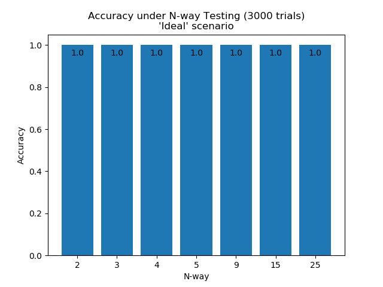
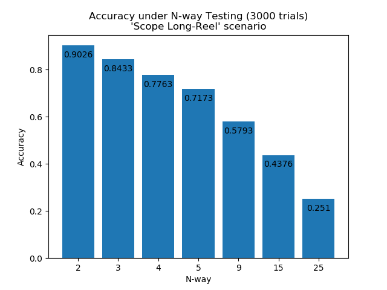
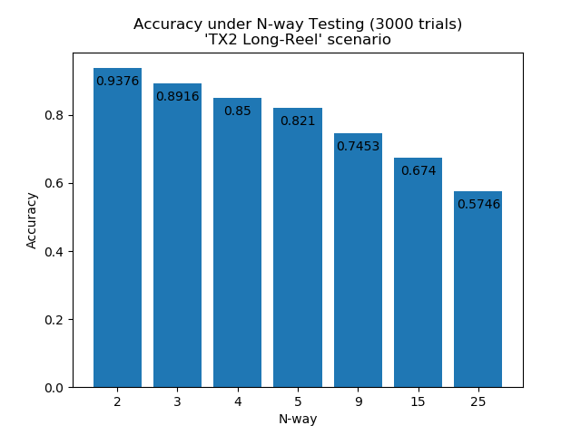

# Automatic PHY-layer Fingerprinting

### RS-485 Serial Verification Example

To illustrate the behaviour of the framework, a concrete example for the fingerprinting of wireline RS-485 traffic is implemented. The system in under active developement and has not yet undergone a substantial evaluation. Nonetheless, initial testing shows the system to perform well, able to differentiate between apparently-identical units of the same transceivers. 

The RS-485 verifier operates under the following threat model:

* The system is developed under a threat model that considers compromised devices and low-resourced SDR attackers. Key to both of these is that the attacker is not able to fully match the physical characteristics of another transmitter (although they may do so to some extent). 
* The system does not, at present, attempt to protect against a well-resourced SDR attacker. In this case the attacker is able to mimic another transmitter with arbitrary precision. 

Other assumptions underpinning the design are:

* The system can be assumed to have a training phase under trusted conditions
* The system might be expected to undergo retraining if network topology changes or devices are added/removed

The RS-485 example uses data collected in a testbed, using industry-grade equipment:

* 4 x USB RS-485 transceivers
* Picoscope 5244D MSO
* Thinkpad X1 Carbon

Model training makes use of a dedicated computer (Intel Xeon Silver 4210, NVIDIA Tesla V100). 

As with the ADS-B case, a Siamese model design is implemented, comparing raw A/B channel signals between two collected messages in an initial training phase. The model is then used to verify collected messages, tracking a long-term fingerprint for each and comparing each message to that baseline.

#### Preliminary Results

N-way testing, using combined dataset collected in a testbed during July 2021:

 

 

 

